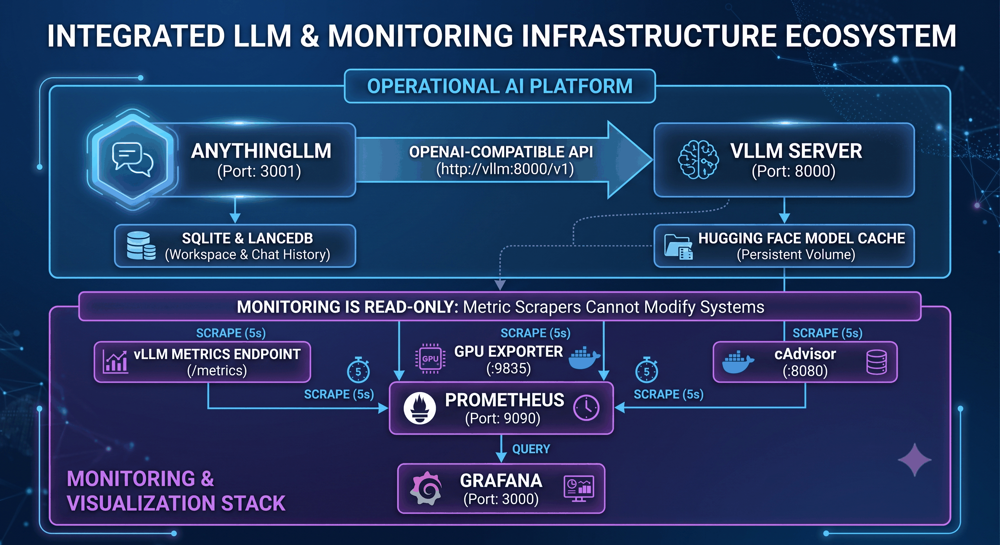

# vLLM + IBM Granite (MoE with CPU Offload)

A self-hosted, OpenAI-compatible LLM stack built around [vLLM](https://github.com/vllm-project/vllm) serving an [IBM Granite](https://huggingface.co/ibm-granite) instruct model, paired with [AnythingLLM](https://github.com/Mintplex-Labs/anything-llm) as a chat/RAG/agent frontend. Runs entirely locally via Docker Compose, targeting a single-GPU workstation. Primary target is 24 GB VRAM with a large amount of host RAM available for CPU offload (native Linux hosts only — see the [CPU offload](#cpu-offload) note below if you're on Docker Desktop/WSL2); 16 GB cards are also supported via on-the-fly quantization — see [Running on smaller GPUs](#running-on-smaller-gpus).

## Architecture



<details>
<summary>Text version</summary>

```
┌──────────────┐        OpenAI-compatible API        ┌──────────────┐
│  AnythingLLM │  ───────────────────────────────▶   │  vLLM server │
│  (port 3001) │  http://vllm:8000/v1                │  (port 8000) │
└──────────────┘                                      └──────────────┘
      │                                                       │
      ▼                                                       ▼
 SQLite + LanceDB                                    Hugging Face model
 (workspace data,                                    cache (persistent
  chat history)                                       Docker volume)


                              Monitoring (read-only)
                    all four containers below only scrape metrics —
                          none of them can modify vLLM/AnythingLLM

┌──────────────┐  ┌──────────────┐  ┌──────────────┐
│  vLLM server │  │ GPU exporter │  │   cAdvisor   │
│   /metrics   │  │    :9835     │  │    :8080     │
└──────┬───────┘  └──────┬───────┘  └──────┬───────┘
       │                 │                 │
       └─────────────────┼─────────────────┘
                          │  scrape (5s)
                          ▼
                   ┌──────────────┐
                   │  Prometheus  │
                   │  (port 9090) │
                   └──────┬───────┘
                          │  query
                          ▼
                   ┌──────────────┐
                   │   Grafana    │
                   │  (port 3000) │
                   └──────────────┘
```

</details>

- **`vllm`** — builds a custom image on top of `vllm/vllm-openai:v0.26.0`, downloads the configured Hugging Face model on first boot, and serves it via vLLM's OpenAI-compatible API. Tool/function calling is enabled using vLLM's `granite` parser, so it can act as the backend for AnythingLLM's Agent features (web scraping, RAG memory, etc.), not just plain chat.
- **`anythingllm`** — the web UI, connected to `vllm` as a `generic-openai` provider. Handles chat, workspaces, embeddings (local, CPU-only) and a LanceDB vector store — no external services required.
- **`prometheus` / `nvidia-gpu-exporter` / `cadvisor` / `grafana`** — read-only monitoring stack; see [Monitoring](#monitoring) below.

## Prerequisites

- Docker Desktop (or Docker Engine) with Docker Compose v2
- An NVIDIA GPU with the [NVIDIA Container Toolkit](https://docs.nvidia.com/datacenter/cloud-native/container-toolkit/latest/install-guide.html) configured (`--gpus` / `deploy.resources.reservations.devices` support)
- Enough free disk space for the model weights (an 8B model in bf16 is roughly 16–18 GB) plus a `hf_cache` Docker volume to persist them across restarts
- A Hugging Face token if the chosen model is gated (set `HF_TOKEN` in `.env`)

## Quick start

1. Copy `.env.docker.example` to `.env` and adjust the values for your hardware (see [Configuration](#configuration) below).
2. Build and start both services:

   ```bash
   docker compose up -d --build
   ```

3. Watch the logs while the model downloads and vLLM warms up (first boot only — this includes a one-time CUDA graph capture step that can take several minutes):

   ```bash
   docker logs -f vllm-granite
   ```

4. Once `vllm-granite` reports `healthy` (`docker ps`), open AnythingLLM at [http://localhost:3001](http://localhost:3001) and log in with the `AUTH_TOKEN` configured in `docker-compose.yml`.

## Configuration

Environment variables consumed by the `vllm` service (set in `.env`, loaded via `env_file`):

| Variable                 | Default                             | Description                                              |
|---------------------------|--------------------------------------|------------------------------------------------------------|
| `MODEL_ID`                | `ibm-granite/granite-3.3-8b-instruct` | Hugging Face model repo to serve                          |
| `HOST`                    | `0.0.0.0`                            | Bind address for the vLLM API server                      |
| `PORT`                    | `8000`                               | Port for the vLLM API server (also used by AnythingLLM)    |
| `MAX_MODEL_LEN`           | `16384`                              | Max context length — see [KV cache capacity](#kv-cache-capacity) for how high this can safely go on your GPU |
| `GPU_MEMORY_UTILIZATION`  | `0.90`                               | Fraction of VRAM vLLM is allowed to reserve                |
| `TENSOR_PARALLEL_SIZE`    | `1`                                   | Increase for multi-GPU tensor parallelism                  |
| `DTYPE`                   | `bfloat16`                           | Model weights/activations dtype                            |
| `HF_TOKEN`                | *(empty)*                            | Hugging Face access token, required for gated models       |
| `CPU_OFFLOAD_GB`          | `0`                                   | GB of model weights to offload to host RAM (passed as `--cpu-offload-gb`). **Only works on native Linux Docker hosts — see [CPU offload](#cpu-offload) below.** Leave at `0` on Docker Desktop/WSL2. |
| `QUANTIZATION`            | *(empty)*                            | Empty = full bf16 weights (default, matches the 24 GB profile below). Set to `bitsandbytes` to quantize weights to 4-bit on load — see [Running on smaller GPUs](#running-on-smaller-gpus). |
| `AUTH_TOKEN`              | `changeme`                            | AnythingLLM UI login password — **change before any real use**             |
| `JWT_SECRET`               | *(placeholder, see below)*           | Required for AnythingLLM to issue session tokens; generate a real value with `openssl rand -hex 32` before any use beyond localhost |

AnythingLLM's provider/storage settings are hardcoded in `docker-compose.yml` under `services.anythingllm.environment` (they rarely change), but `AUTH_TOKEN` and `JWT_SECRET` are read from `.env` via Compose variable substitution (same mechanism already used for `PORT`), with the same insecure defaults falling back if unset — set both in `.env` before exposing this stack beyond `localhost`.

### Workspace settings (language consistency)

At this model size (8B), Granite is inconsistent about replying in the user's language — it will sometimes claim (incorrectly) that it can only respond in English, or silently switch to English mid-conversation, especially at higher sampling temperatures. This isn't a config bug: querying vLLM directly confirms the model *can* produce fluent Italian, it just doesn't reliably choose to.

Two workspace-level settings (stored in AnythingLLM's own SQLite DB — `anythingllm_storage` volume, *not* a repo file, so they don't survive a fresh volume and aren't captured by `git`) mitigate this:

- **System prompt** (Workspace Settings → Chat Settings → Prompt) — prepend an explicit instruction, e.g. *"Always respond in the same language the user writes in, matching it exactly, unless the user explicitly asks you to switch or translate. Never claim you are only able to respond in English."*
- **Temperature** (Workspace Settings → Chat Settings → LLM Temperature) — lower than the provider default (~0.7+) improves instruction-following consistency at the cost of response variety. `0.1` gave the most consistent correct-language replies in testing, but was raised to `0.4` in this setup — the current recommended value — since `0.1` was too restrictive on response variety/quality; `0.4` still held consistent correct-language behavior across repeated tests.

## CPU offload

`start.sh` passes `CPU_OFFLOAD_GB` to `vllm serve` as `--cpu-offload-gb`, which lets vLLM run models larger than available VRAM by keeping part of the weights in host RAM (treat it as "virtual VRAM" ≈ real VRAM + `CPU_OFFLOAD_GB`).

**This only works on a native Linux Docker host.** vLLM's V1 engine requires UVA (pinned/page-locked host memory) for CPU offloading, and **Docker Desktop on WSL2 does not support it** — any `CPU_OFFLOAD_GB` value greater than `0` crashes the container on startup with:

```
AssertionError: V1 CPU offloading requires uva (pin memory) support
```

This is the same underlying limitation behind the `Using 'pin_memory=False' as WSL is detected` warning that always appears in the logs. Keep `CPU_OFFLOAD_GB=0` (the default) if you're running under WSL2 — this repo's 8B Granite default fits entirely in a 24 GB GPU anyway. If you move this stack to a bare-metal/native Linux Docker host, you can raise `CPU_OFFLOAD_GB` to run the larger MoE models listed in `.env`'s comments (e.g. `granite-3.3-20b-instruct`, `Mixtral-8x7B`, `Qwen2-57B-A14B`).

**vLLM v0.25+ on WSL2 needs one more fix, unrelated to `CPU_OFFLOAD_GB`.** Starting with vLLM v0.25, the GPU worker unconditionally allocates a pinned ("UVA") buffer for token-ID staging as part of its "Model Runner V2" — not just for CPU offload — so even with `CPU_OFFLOAD_GB=0` the container fails at engine startup on WSL2 with:

```
RuntimeError: UVA is not available
```

Set `VLLM_USE_V2_MODEL_RUNNER=0` in `.env` (commented out by default in `.env.docker.example`) to fall back to the original model runner, which doesn't require UVA. Leave it commented out on a native Linux host (e.g. the 3090 profile) — Model Runner V2 works fine there and is more efficient.

## KV cache capacity

On this setup (24 GB GPU, `ibm-granite/granite-3.3-8b-instruct`, `GPU_MEMORY_UTILIZATION=0.90`), vLLM reports at startup (`docker logs vllm-granite`):

```
GPU KV cache size: 29,696 tokens
Maximum concurrency for 16,384 tokens per request: 1.81x
```

This **29,696-token KV cache budget is essentially fixed** by leftover VRAM after loading the model weights (~15.25 GiB) — it doesn't meaningfully change with `MAX_MODEL_LEN`, since `MAX_MODEL_LEN` only needs to fit within it. It's the real ceiling to watch:

- `MAX_MODEL_LEN` must stay **below ~29,696** or vLLM refuses to start (not enough KV cache blocks for even one full-length request).
- Whatever headroom is left above `MAX_MODEL_LEN` determines concurrency — e.g. at `MAX_MODEL_LEN=16384` there's room for ~1.81 concurrent full-length requests; push `MAX_MODEL_LEN` close to 29,696 and you're limited to a single request at a time, with no room for AnythingLLM (or anyone else) to run a second chat concurrently.

If AnythingLLM's Agent still hits a `This model's maximum context length is N tokens` 400 error above this new limit, raise `MAX_MODEL_LEN` in `.env` and `GENERIC_OPEN_AI_MODEL_TOKEN_LIMIT` in `docker-compose.yml` together (they must match), then re-check the actual logged `GPU KV cache size` after restart — don't just assume the new value fits.

## Running on smaller GPUs

[gpu-profiles.json](gpu-profiles.json) collects known-good (or best-estimate) `GPU_MEMORY_UTILIZATION` / `MAX_MODEL_LEN` / `QUANTIZATION` values per GPU/VRAM tier, plus `VLLM_USE_V2_MODEL_RUNNER` / `CPU_OFFLOAD_GB` per host environment (native Linux vs. WSL2) — the two vary independently, since one depends on the card and the other on the Docker host. Apply a combination to `.env` with:

```bash
./apply-gpu-profile.sh --list                 # see available GPU/host profile keys
./apply-gpu-profile.sh rtx-5080-16gb wsl2     # writes the matching values into .env
```

It only touches those five keys — `MODEL_ID`, `HF_TOKEN`, `AUTH_TOKEN`, `JWT_SECRET`, etc. are left alone. Entries marked `verified: false` in the JSON are extrapolated from a same-VRAM or same-family card, not tested directly — treat them as a starting point. Add new GPUs by editing the JSON, not the script.

The 24 GB profile (bf16 weights, `QUANTIZATION` empty) is the one documented and tested throughout the rest of this README (KV cache numbers, concurrency, etc.). On a 16 GB card, `ibm-granite/granite-3.3-8b-instruct` in bf16 does **not** fit: the weights alone are ~15.25 GiB, more than the ~14.4 GB budget `GPU_MEMORY_UTILIZATION=0.90` gives you on a 16 GB card, leaving nothing for the KV cache. CPU offload isn't a workaround here if you're on Docker Desktop/WSL2 — see [CPU offload](#cpu-offload).

Set `QUANTIZATION=bitsandbytes` in `.env` to quantize the same `MODEL_ID` to 4-bit on load (`--quantization bitsandbytes --load-format bitsandbytes`, added automatically by `start.sh` when the variable is set). This drops the weight footprint to roughly 4–5 GB, leaving healthy headroom for KV cache and concurrency at `MAX_MODEL_LEN=16384` on a 16 GB card. Leave `QUANTIZATION` empty on 24 GB+ cards — the default bf16 path is unaffected either way.

**NVIDIA Blackwell (RTX 50-series) note**: if you're on an RTX 50-series GPU (e.g. RTX 5080/5090, `sm_120`), you need a vLLM image recent enough to include Blackwell kernel support — this repo pins `vllm/vllm-openai:v0.26.0` in the [Dockerfile](Dockerfile) for that reason. An older pinned tag will fail at model-load time with `CUDA capability sm_120 is not compatible with the current PyTorch installation`, which is unrelated to VRAM sizing and happens even before the model finishes loading.

## Persistence

Two named Docker volumes keep state across container recreation:

- `hf_cache` — the Hugging Face cache (`/root/.cache/huggingface`), so the model isn't re-downloaded on every restart
- `anythingllm_storage` — AnythingLLM's SQLite database, LanceDB vector store, and uploaded documents

## Notable implementation details

- **XetHub is disabled.** `start.sh` monkey-patches `huggingface_hub` to force plain HTTPS downloads (`xet_file_data=None`) instead of the Xet/CAS backend, which is unreliable in some network environments.
- **Startup retries.** The model download is retried up to 30 times (10s apart) before falling back to letting vLLM attempt the download itself.
- **Tool calling.** `vllm serve` is started with `--enable-auto-tool-choice --tool-call-parser granite`, required for AnythingLLM's Agent mode (function calling) to work against this model — without it, agent requests fail with an empty `400 Bad Request`.
- **`ipc: host`** is required by vLLM for Unified Virtual Addressing (pinned buffers shared between CPU and GPU); `--ipc=private` (Docker's default) breaks this.
- Both services expose Docker healthchecks; `anythingllm` waits on `vllm`'s healthcheck (`depends_on: condition: service_healthy`) before starting.

## Testing the API directly

Once `vllm-granite` is healthy, you can talk to it without going through AnythingLLM:

```bash
curl http://localhost:8000/v1/chat/completions \
  -H "Content-Type: application/json" \
  -d '{
    "model": "granite",
    "messages": [{"role": "user", "content": "Hello!"}]
  }'
```

## Monitoring

A read-only Grafana dashboard at [http://localhost:3000](http://localhost:3000) (no login required) visualizes what's happening inside vLLM in real time, backed by four extra containers:

- **`prometheus`** (port 9090) — scrapes metrics every 5s from vLLM, the GPU exporter, and cAdvisor
- **`nvidia-gpu-exporter`** — real GPU hardware metrics via `nvidia-smi` (utilization %, VRAM used/total, temperature)
- **`cadvisor`** — per-container resource usage; the `vllm-granite` container's RAM usage is the practical signal for whether [CPU offload](#cpu-offload) is actually keeping weights in host RAM (once it's usable — see that section)
- **`grafana`** — the dashboard itself, pre-provisioned with a Prometheus datasource and a `vLLM Granite` dashboard (`monitoring/grafana/dashboards/vllm.json`)

None of these containers can modify vLLM or AnythingLLM — they only scrape `/metrics` endpoints. The dashboard covers:

- Requests running/waiting, GPU KV-cache usage %, prefix-cache hit rate, request success/preemption counts
- Token throughput (prompt + generation tokens/s)
- Latency: time-to-first-token, time-per-output-token, end-to-end request latency (p50/p95)
- GPU utilization, VRAM used/total, temperature
- `vllm-granite` container RAM/CPU usage (the CPU-offload readiness signal)

**Security note**: Grafana is configured with `GF_AUTH_ANONYMOUS_ENABLED=true` (Viewer role, can't edit/delete) so there's no extra password to manage — this is meant for `localhost`/trusted-network use only. Don't expose port 3000 to an untrusted network without adding real authentication.

Start just the monitoring stack on its own with `docker compose up -d prometheus nvidia-gpu-exporter cadvisor grafana` (vLLM/AnythingLLM must already be running for the vLLM panels to show data).

## Troubleshooting

- **Dockerfile parse errors on custom `RUN` blocks** — avoid multi-line inline heredocs directly in `RUN` instructions; ship scripts as files and `COPY` them in instead (see `start.sh`).
- **`SafetensorError: InvalidHeaderDeserialization`** — a corrupted/partial model shard, usually from an interrupted download. Stop the container and clear the cached model directory from the correct volume (check the real volume name with `docker inspect vllm-granite --format '{{range .Mounts}}{{.Name}} -> {{.Destination}}{{"\n"}}{{end}}'` — it's derived from the Compose *project* name, not the container name), then restart to trigger a clean re-download.
- **AnythingLLM Agent replies with `400 status code (no body)`** — vLLM wasn't started with tool-calling support; make sure `--enable-auto-tool-choice --tool-call-parser granite` are present in `start.sh`.
- **AnythingLLM login fails with `Cannot create JWT as JWT_SECRET is unset`** — set `JWT_SECRET` in `.env` (falls back to a non-functional placeholder if unset).
- **`Conflict. The container name "/anythingllm" is already in use`** — another, unrelated Docker Compose project on this machine also uses `container_name: anythingllm`; check with `docker ps -a --filter name=anythingllm` before removing anything. This repo's service is named `vllm-granite-anythingllm` precisely to avoid colliding with other stacks.
- **`AssertionError: V1 CPU offloading requires uva (pin memory) support`** — you're on Docker Desktop/WSL2 with `CPU_OFFLOAD_GB` set above `0`; see [CPU offload](#cpu-offload).
- **`This model's maximum context length is N tokens. However, you requested M tokens`** — AnythingLLM's Agent mode (tool definitions + RAG context + chat history) built a prompt longer than `MAX_MODEL_LEN`. Raise `MAX_MODEL_LEN` in `.env` and `GENERIC_OPEN_AI_MODEL_TOKEN_LIMIT` in `docker-compose.yml` together, staying within the [KV cache capacity](#kv-cache-capacity) for your GPU.
